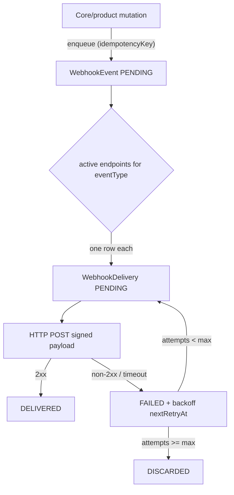

# Webhook Event + Idempotency Model (DESIGN ONLY)

Status: proposed / not implemented. This document is the design deliverable for the
"webhook event/idempotency" gap. No Prisma models or migrations are created until
this design is approved. When approved, it requires **exactly one** new migration
and introduces **net-new** models (no duplication of the existing `WebhookEndpoint`).

## Why

The repo already has `WebhookEndpoint` (subscriber configuration: url, secretHash,
events[], isActive). What is missing is the delivery layer:

- A durable record of each emitted event (so producers can replay/audit).
- Idempotency, so the same logical event is never emitted/delivered twice.
- Per-endpoint delivery attempts with retry/backoff and failure visibility.

`WebhookEndpoint` answers "who is subscribed". The proposed models answer
"what happened, was it delivered, and exactly once".

## Proposed models (net-new)

```prisma
// NOTE: design only. Do not add to schema.prisma until approved.

enum WebhookEventStatus {
  PENDING
  DELIVERING
  DELIVERED
  FAILED
  DISCARDED
}

enum WebhookDeliveryStatus {
  PENDING
  SUCCEEDED
  FAILED
}

model WebhookEvent {
  id             String             @id @default(cuid())
  organizationId String
  productId      String?
  eventType      String             // e.g. "wexpay.payment.created"
  // Idempotency: a producer-supplied stable key. Unique per organization so the
  // same logical event can never be enqueued twice.
  idempotencyKey String
  payloadJson    Json
  status         WebhookEventStatus @default(PENDING)
  attempts       Int                @default(0)
  lastError      String?
  createdAt      DateTime           @default(now())
  updatedAt      DateTime           @updatedAt

  organization Organization      @relation(fields: [organizationId], references: [id], onDelete: Cascade)
  product      Product?          @relation(fields: [productId], references: [id])
  deliveries   WebhookDelivery[]

  @@unique([organizationId, idempotencyKey])
  @@index([organizationId])
  @@index([productId])
  @@index([eventType])
  @@index([status])
  @@index([createdAt])
}

model WebhookDelivery {
  id         String                @id @default(cuid())
  eventId    String
  endpointId String
  status     WebhookDeliveryStatus @default(PENDING)
  attempt    Int                   @default(0)
  statusCode Int?
  error      String?
  nextRetryAt DateTime?
  deliveredAt DateTime?
  createdAt  DateTime              @default(now())
  updatedAt  DateTime              @updatedAt

  event    WebhookEvent    @relation(fields: [eventId], references: [id], onDelete: Cascade)
  endpoint WebhookEndpoint @relation(fields: [endpointId], references: [id], onDelete: Cascade)

  // One delivery row per (event, endpoint) prevents duplicate fan-out.
  @@unique([eventId, endpointId])
  @@index([status])
  @@index([nextRetryAt])
}
```

Back-relations to add when implemented:

- `Organization.webhookEvents WebhookEvent[]`
- `Product.webhookEvents WebhookEvent[]`
- `WebhookEndpoint.deliveries WebhookDelivery[]`

## Idempotency strategy

1. Producer-side (enqueue): events are created with a stable `idempotencyKey`
   derived from the source entity + action (e.g. `payment:<paymentId>:created`).
   The `@@unique([organizationId, idempotencyKey])` constraint makes a duplicate
   enqueue a no-op (catch P2002, ignore).
2. Delivery-side (fan-out): one `WebhookDelivery` per active subscribed endpoint,
   guarded by `@@unique([eventId, endpointId])`, so retries never create duplicates.
3. Consumer-side: the outgoing request includes the event id as a delivery header
   (e.g. `X-Wexon-Event-Id`) so subscribers can dedupe on their end too.

## Emit / retry flow



## Boundaries respected

- Net-new only: does not duplicate `WebhookEndpoint` or any existing Core model.
- Signing reuses the existing `WebhookEndpoint.secretHash` (HMAC), consistent with
  current key handling.
- Billing/payment state is never an access decision; webhook emission is an effect
  of a mutation, not an authorization gate.

## Implementation checklist (when approved)

1. Add the two models + enums + back-relations to `prisma/schema.prisma`.
2. Generate exactly one migration.
3. Add an `enqueueWebhookEvent()` producer helper (idempotent) and a delivery
   worker with exponential backoff.
4. Emit events from Core/product mutations (e.g. via the shared audit/mutation path).
